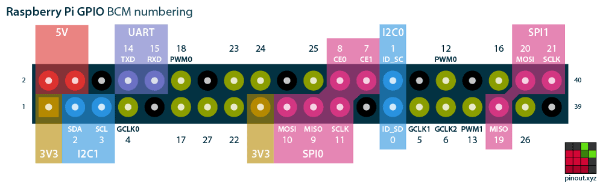

# DHT sensor with Raspberry Pi 400
## Beginning with Pi's GPIO

Setting Up required packages:

    git clone https://github.com/adafruit/Adafruit_Python_DHT.git
    cd Adafruit_Python_DHT
    sudo python3 setup.py install

Check that GPIO is enabled. First open rasberry pi cofiguration menu:

    sudo raspi-config

After window opens go to `Interface` and `Enable` [I2C](https://raspberrytips.com/glossary/i2c/) and [SPI](https://raspberrytips.com/glossary/spi/) 

Or: 

    sudo raspi-config nonint do_rgpio 1

Check that python's GPIO package (rpi.gpio) is installed:

    sudo apt install python3-rpi.gpio

## Some extra changes:

Command to open Pi's `File manager`

    xdg-open [folder_name]

### Setup SSH conection to Raspberry Pi 

Activate ssh-connection via configuration menu

### SSH-key from github:
[Link](https://docs.github.com/en/authentication/connecting-to-github-with-ssh/generating-a-new-ssh-key-and-adding-it-to-the-ssh-agent) for basic ssh key generation as well as ssh agent:

    ssh-keygen -t ed25519 -C "your_email@example.com"

### Markdown insert picture:

    

#### Command to save string\byte output to file

    [command_to_execute] 2>&1  | xargs -I _  echo _ > delete.txt
